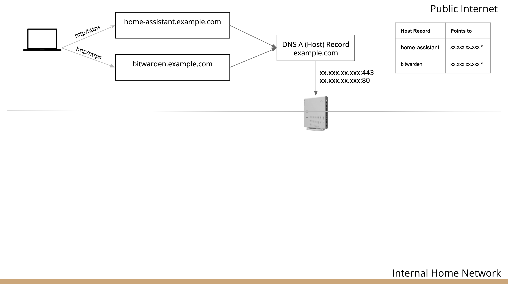
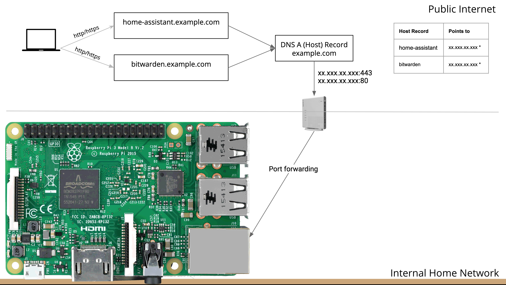
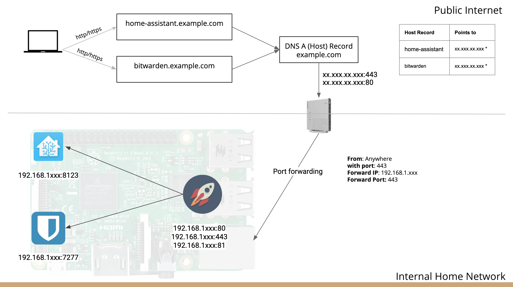
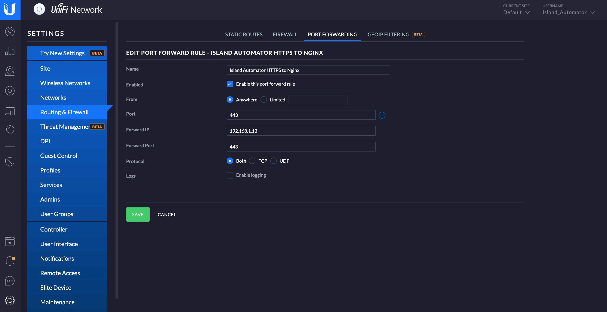
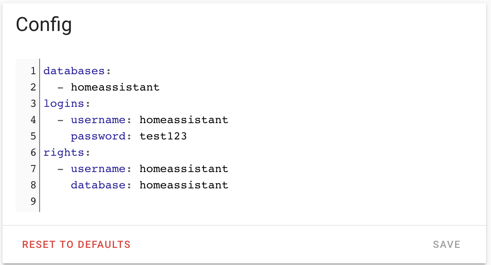
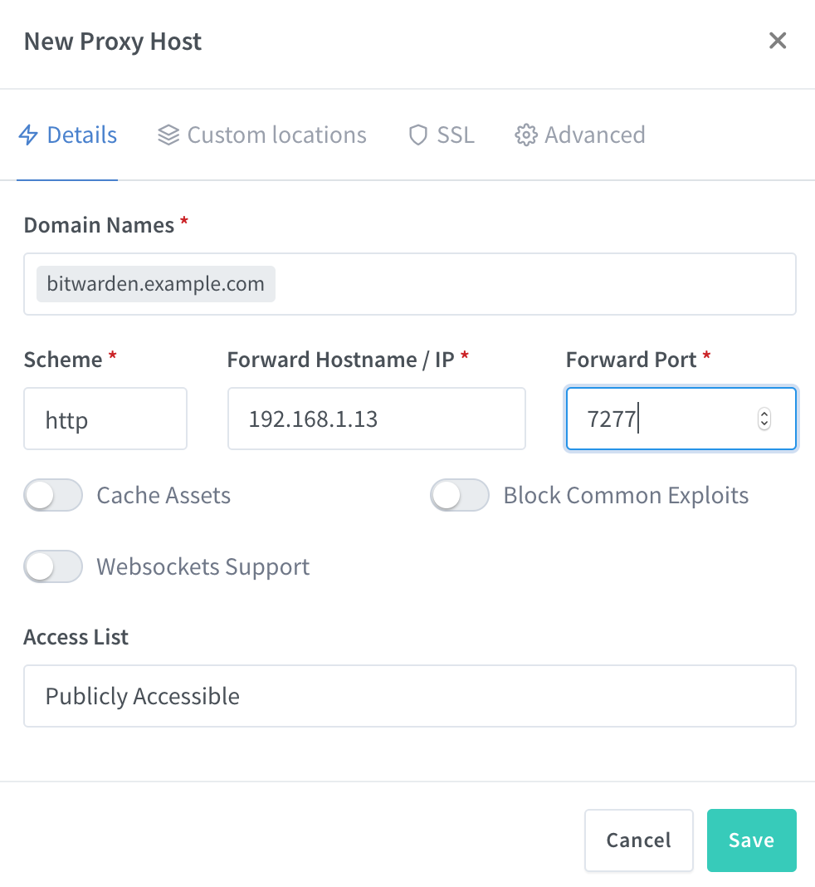
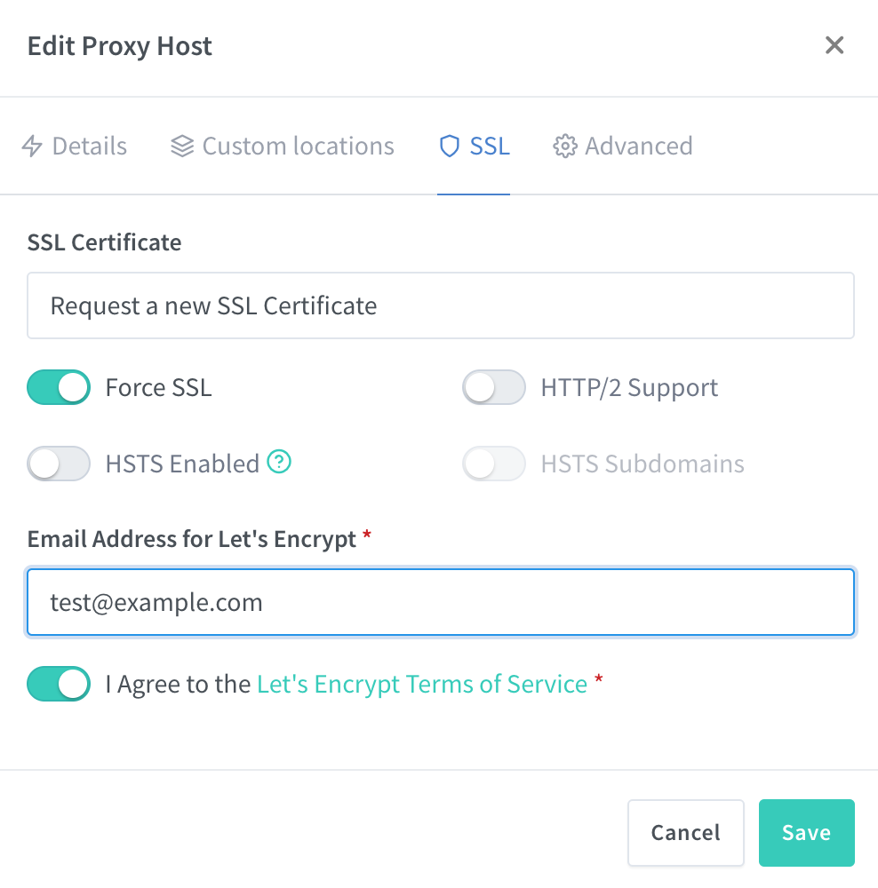

# Setting up the Bitwarden add-on on Home Assistant Tutorial
*Using Nginx Proxy Manager or Duckdns (coming Soon)*

Table of contents
=================

<!--ts-->
   * [The Bitwarden Add-on](#the-bitwarden-add-on)
   * [From Public Domain to local the Local Bitwarden Add-on](#from-public-domain-to-local-the-local-Bitwarden-add-on)
      * [Creating an "A Host Record"](#creating-an-a-host-record)
      * [Redirecting incomming traffic to my local network"](#redirecting-incomming-traffic-to-my-local-network)
      * [Setting up Port Forwarding](#Setting-up-Port-Forwarding)
   * [Installing Nginx Proxy Manager (and MariaBD)](#installing-nginx-proxy-manager-and-mariabd)
   * [Installing Bitwarden](#Installing-Bitwarden)
   * [Todo](#todo)
   
<!--te-->

# The Bitwarden add-on #
Bitwarden is an Add-on on Home Assistant that can be installed and used as a local Vault for all your passwords. It’s like a LastPass but instead of using the cloud, it’s actually running locally on the same machine as your Home-Assistant. 

For Bitwarden to be useful you will need to be able to access it from the public internet, this can be achieved by using a domain and routing the traffic to your Bitwarden Add-on. 

To correctly run the Bitwarden add-on on Home Assistant you need to have an SSL certificate. Before I show you how to install this, I would like to show you the setup we are going for.

# From public domain to local the local Bitwarden add-on#
Imagine you want to be able to access Bitwarden from an external (sub)domain like bitwarden.example.com. The first thing you need to do is to create the subdomain bitwarden and point it to the public IP of your ISP (Internet Service Provider) modem. 

## Creating an A Host Record ##
This can be achieved by creating an “A Host Record” for bitwarden to point to the IP of your ISP modem. This will route the HTTP and HTTPS traffic from the bitwarden.example.com domain towards your modem in your house.

If you don’t know this IP you can go to Google.com and while on your home network (without using a VPN or anything that can change your IP) search for “What’s my IP” and you should see the IP of your modem given to you by your ISP. 
 


If you want to access your Home Assistant from the public internet using your own (sub)domain home-assistant.example.com, you need to do the same by creating an "A Host Record" to point to the IP of your modem.

_note creating or changing an “A Host Record” will take some time before it will take effect. This depends on the DNS record TTLs. Usaually it's between 2 to 8 hours, but in rare cases this can take up to 24 hours._

## Redirecting incomming traffic to my local network ##
After this step, we need to make sure the traffic gets routed correctly to your internal network. When the HTTP/HTTPS traffics gets redirected to your “house” it will be with the port 80 for HTTP and 443 for HTTPS.



Redirecting this traffic can be achieved by forwarding the external ports to the IP of your machine running Home Assistant and the Entrance port(s) of your Nginx Add-on. If Nginx is running on another server you need to use that ip.

In this example, I’m using a Raspberry Pi 3 to run Home Assistant and the Nginx Proxy Manager and the Bitwarden Add-ons. Because all of these applications are running on the same Raspberry Pi they will all have the same (internal) IP address but will be exposed to different ports.



The Nginx Proxy Manager has three ports that are exposed, but we only need the two Entrance port(s) 443 and 80. Port 81 is used for the UI of the Proxy Manager. 

## Setting up Port Forwarding ##
Setting up port forwarding can be done on your internal router, this step is always different for every router. But the general concept should be the same, you need to route all the incoming traffic with the ports 443 and 80 towards the internal IP of your instance running your Nginx. In my case, I’m using Unifi Controller from Ubiquiti. 



In the Unifi Controller, you need to go to Settings => Routing & Firewall => Port Forwarding and create a new Port Forward Rule for All Incoming traffic with the port 443 to be forwarded to the IP of your Home Assistant (in my case that is 192.168.1.13) and the port 443, this is the HTTPS Entrance port and click “Save”. You need to also do this for the incoming port 80 to be forwarded to the IP of your Home Assistant with the port 80.

_note: make sure that there are no other port forwarding rules for port 80 or 443 enabled._

# Installing Nginx Proxy Manager (and MariaBD) #
In Home Assistant head on over to the Supervisor => Add-on store => and search for the Nginx Proxy Manager and click on install. Go back to the Add-On store search for MariaDB, the Nginx Proxy Manager requires the MariaDB to be installed and configured for it to run correctly. Install the MariaDB Add-on and make sure to configure the add-on correctly with a password.



After this is done, start the MariaDB Add-on and make sure it’s running correctly by looking in the logs. Now that MariaDB is running, go to the Nginx Proxy Manager and start the Add-on. 

Next, we need to go to the UI of the Nginx proxy manager by clicking on the “Open Web UI” link. Click on the Proxy host and Add Proxy Host.



Enter the information in the form as shown in the image above and click on “Save”. The IP address is the same as the home assistant and the port for Bitwarden is 7277. What this actually does is redirecting the traffic coming from the bitwarden.example.com domain to the internal Bitwarden application running on the raspberry pi on the port 7277.  

Now we can do the same for Home Assistant, by entering the home-assistant.example.com domain and the same IP address and the port 8123 and make sure Websockets Support is turned on as the Home Assistant UI uses Websockets and hit “Save”

Make sure that the URL is set up correctly by clicking on the domain on the Proxy Host page. If you get redirected to the correct application it’s time to request the SSL Certificate.



On the Proxy Host Page click on the three dots on the right and click on Edit and go to the SSL in the menu and enter the correct information. 

Making sure you chose the option to “Request a new SSL Certificate” and switch on the “Force SSL” option and Agreeing with the Let’s Encrypt Terms of Service and click on “Save". 

After doing this go to the logs of the add-on and look `--cert-name "npm-#"` and save the part with npm-# for later where # should be a number. 

Do this for the bitwarden.example.com and the home-assistant.example.com domain.

# Installing Bitwarden #
Now that we have everything ready let’s install the Bitwarden Add-on from the Add-on store.

after it’s installed it’s time to configure the add-on. In the configuration tab, make sure you change the config “certfile” and “keyfile” as shown below and change the npm-# part with yours saved in the previous step and click on “Save”.

```
ssl: true
certfile: nginxproxymanager/live/npm-#/fullchain.pem
keyfile: nginxproxymanager/live/npm-#/privkey.pem
```

1. Start the "Bitwarden RS" add-on.
2. Check the logs of the "Bitwarden RS" add-on to see if everything went well and to get the admin token/password.
3. Click the "OPEN WEB UI" button to open Bitwarden RS.
4. Add /admin to the URL to access the admin panel, e.g., https://bitwarden.example.com/admin. Log in using the admin token you got in step 2
5. Go to “General setting” and make sure the “Require email verification on signups” is NOT ticked off, by default this should already be the case.
6. The admin/token in the logs is only shown until it is saved or changed. Hit save in the admin panel to use the randomly generated password or change it to one of your choosing.
7. Be sure to store your admin token somewhere safe.
8. In the top menu go back to the Vault and Create Account
9. Fill in the information and click on Submit.
10. Login with the newly created credentials

# Todo #
- DuckDNS
